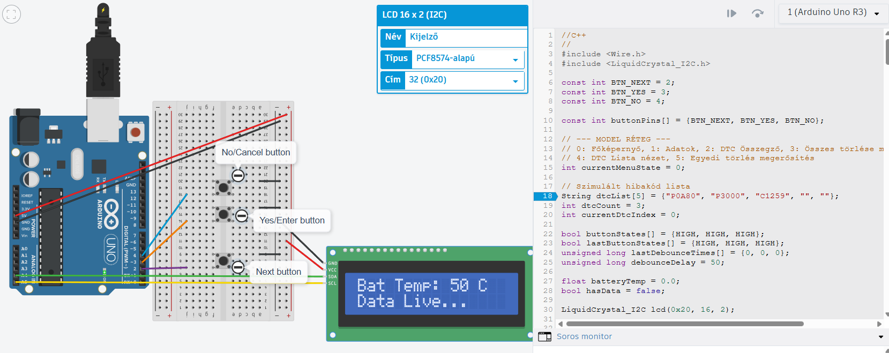
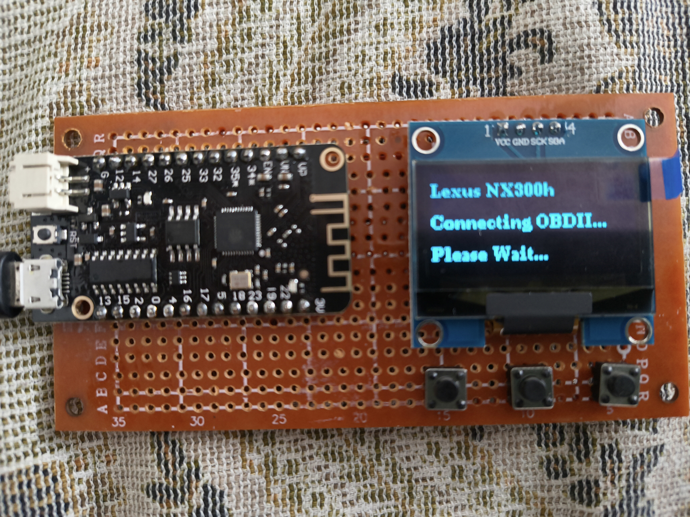

# Lexus NX300h OBD2 / TPMS Telemetria Kijelző

## Projekt leírása
Ez a projekt egy egyedi építésű, hardveres telemetria kijelző, amely kifejezetten a Lexus NX300h hibrid járművekhez készült. Az eszköz egy ESP32 mikrokontrollerre épül, és Bluetooth kapcsolaton keresztül, Master (Mester) módban kommunikál az autóba csatlakoztatott ELM327 OBD2 diagnosztikai adapterrel. 

A műszer egy 4 állású, nyomógombokkal vezérelhető (MVVM architektúrájú) menürendszerrel rendelkezik. Fő funkciói közé tartozik a hibrid akkumulátor hőmérsékletének valós idejű megjelenítése, a TPMS (guminyomás) adatok kerekenkénti monitorozása (2 tizedesjegy pontossággal), valamint a jármű hibakódjainak (DTC) olvasása és törlése.

### Képernyőképek

*Logikai szimuláció a TinkerCAD környezetben*


*A megépített fizikai hardver az OLED kijelzővel*

---

## Projekt elérhetősége
A projekt logikai szimulációja és a menürendszer alapjainak tesztelése a TinkerCAD platformon készült.

* **TinkerCAD Projekt:** [Kattints ide a szimuláció megtekintéséhez](https://www.tinkercad.com/things/gCaSdsdhM4q-arduino-odb2-reader)

---

## Eltérés a TinkerCAD és a fizikai megépítés között
Mivel a TinkerCAD környezet limitált hardveres szimulációs képességekkel rendelkezik, a logikai modell és a valós, megépített műszer között az alábbi kritikus eltérések vannak:

1. **A Mikrokontroller:** A TinkerCAD szimulációban egy szabványos **Arduino Uno** futtatja a kódot, míg a fizikai megépítéshez egy sokkal erősebb, beépített rádióval rendelkező **ESP32 (Lolin32 Lite klón)** lett felhasználva.
2. **Az Adatkapcsolat (Bluetooth vs. Serial):** A szimulátorban a gépjármű (OBD2) válaszait a Soros Monitoron (Serial) keresztüli manuális karakter-beküldés helyettesíti. A valós eszközben egy dedikált `BluetoothSerial` kapcsolat fut, amely név alapú azonosítással és PIN-kóddal csatlakozik az ELM327 adapterhez.
3. **Lábkiosztás és I2C Routing:** A szimulátor alapértelmezett digitális lábakat használ. A valós nyomtatott áramkörön a rövidzárlatok elkerülése és az optimális ón-ösvények (Solder Bridging) kialakítása érdekében eltérő lábkiosztást alkalmaztunk. A nyomógombok a *Nested Routing* elv alapján az ESP32 `5`, `18`, és `23`-as lábaira kerültek, a kijelző pedig Szoftveres I2C-vel (`19` SCK, `22` SDA) csatlakozik, áthidalva a fizikai kereszteződéseket.

---

## Alkatrész lista
A fizikai műszer megépítéséhez az alábbi komponensek szükségesek:

* **1 db** ESP32 fejlesztői lapka (Wemos Lolin32 Lite klón, 26 lábú kivitel)
* **1 db** 1.3" (vagy 0.96") OLED Kijelző (I2C kommunikáció, 4 tűs: VCC, GND, SCK, SDA)
* **3 db** 2 lábú mikrokapcsoló (Nyomógomb a menü vezérléséhez)
* **1 db** Előfúrt nyomtatott áramköri próbapanel (Perfboard)
* Szilárd erű vezeték ("Mikro-gerinc" és "Felüljáró" a tápellátáshoz) és forrasztóón
* **1 db** ELM327 Bluetooth OBD2 olvasó adapter (A gépjármű diagnosztikai portjához)

---
## Változók:
* const int BTN_NEXT, BTN_YES, BTN_NO: Konstansok, a Lapozás (5), Igen (18) és Mégse (23) gombok PIN kódjai,
* const int buttonPins[]: Egy tömb, ami összefogja a három gomb lábkiosztását,
* u8g2 és SerialBT: az OLED kijelző és a Bluetooth rádió külső függőségeinek objektum példányai,
* int currentMenuState: A menürendszer épp melyik menüjén állunk,
* bool isConnected: felépült-e a Bluetooth kapcsolat az ELM327 adapterrel,
* float tpmsFL, tpmsFR, tpmsRL, tpmsRR: a négy kerék (Bal-Első, Jobb-Első, Bal-Hátsó, Jobb-Hátsó) nyomásértékeinek tárolására,
* String dtcList[]: Egy 9 férőhelyes szöveges (String) memóriatömb, amibe a kiolvasott hibakódok tárolására,
* int dtcCount: aktuálisan hány darab olvasott hibakód várakozik a dtcList tömbben,
* int currentDtcIndex: Lista-mutató (index), a fenti listából melyiket kell mutatni a kijelzőn,
* bool buttonStates[]: Logikai tömb, a 3 gomb letisztított, már pergésmentesített (tehát ténylegesen érvényes) állapotát tárolja,
* bool lastButtonStates[]: Logikai tömb, a gombok legutóbbi fizikai állapotát rögzíti, hogy az állapotgép érzékelni tudja a lenyomás (él) pillanatát,
* unsigned long lastDebounceTimes[]: Hatalmas számokat tároló "stopperórák", a 3 gomb utolsó feszültség-változásának pontos ezredmásodperce,
* unsigned long debounceDelay: a pergésmentesítéshez szükséges kötelező türelmi idő milliszekundumban,
* float batteryTemp: az OBD2-ből kinyert és dekódolt hibrid akkumulátor hőmérsékletét tárolja Celsius fokban,
* bool hasData: ez jelzi a kijelzőnek, hogy megérkezett-e már az első sikeres adatcsomag (amíg hamis, kötőjeleket mutat).
---

## Forráskód
```cpp
//C++
// MVVM design pattern, SOLID, Clean Code
#include <Wire.h>
#include <U8g2lib.h>
#include <BluetoothSerial.h>

const int BTN_NEXT = 5;  // bal oldali v. felső gomb (Lapozás)
const int BTN_YES = 18;  // Középső gomb (Igen)
const int BTN_NO = 23;   // jobb oldali v. alsó gomb (Mégse)

const int buttonPins[] = {BTN_NEXT, BTN_YES, BTN_NO};

// I2C Szoftveres meghajtás (SCK=19, SDA=22)
U8G2_SH1106_128X64_NONAME_1_SW_I2C u8g2(U8G2_R0, /* clock=*/ 19, /* data=*/ 22, /* reset=*/ U8X8_PIN_NONE);
BluetoothSerial SerialBT;

// model
int currentMenuState = 0;
bool isConnected = false;

// TPMS Adatok
float tpmsFL = 0.00; // Bal Első
float tpmsFR = 0.00; // Jobb Első
float tpmsRL = 0.00; // Bal Hátsó
float tpmsRR = 0.00; // Jobb Hátsó

// DTC Adatok
String dtcList[9] = {"", ""};
int dtcCount = 3;
int currentDtcIndex = 0;

// Gomb pergésmentesítés
bool buttonStates[] = {HIGH, HIGH, HIGH};
bool lastButtonStates[] = {HIGH, HIGH, HIGH};
unsigned long lastDebounceTimes[] = {0, 0, 0};
unsigned long debounceDelay = 50;

float batteryTemp = 0.0;
bool hasData = false;

void setup()
{
  Serial.begin(115200);
  
  for (int i = 0; i < 3; i++)
  {
    pinMode(buttonPins[i], INPUT_PULLUP);
  }
  
  u8g2.begin();
  
  u8g2.setFont(u8g2_font_ncenB08_tr);
  
  drawConnectingScreen();
  
  SerialBT.begin("Lexus_Display", true);
  
  // Biztonsági azonosítás az ELM327 felé ---
  SerialBT.setPin("1234");
  // A kapcsolódás az ELM327-hez
  isConnected = SerialBT.connect("OBDII");
  
  if (isConnected)
  { // 3 üzenet küldése az ODB2-nek - ELM327 incializálása
    SerialBT.println("ATZ"); // reseteli az ELM327-et
    delay(1000);
    SerialBT.println("ATE0"); // kikapcsolja a visszhangot - hogy ne ismételje vissza a kapott utasítást
    delay(500);
    SerialBT.println("ATL0"); // /r/n helyett /r az új sor
    delay(500);
  }
  
  updateDisplay();
}

void loop()
{
  handleBluetoothData();
  
  readButtons();
}

// vezérlés
void readButtons()
{
  for (int i = 0; i < 3; i++)
  {
    bool reading = digitalRead(buttonPins[i]);
    
    if (reading != lastButtonStates[i])
    {
      lastDebounceTimes[i] = millis();
    }
    
    if ((millis() - lastDebounceTimes[i]) > debounceDelay)
    {
      if (reading != buttonStates[i])
      {
        buttonStates[i] = reading;
        
        if (buttonStates[i] == LOW)
        {
          processButtonPress(buttonPins[i]);
        }
      }
    }
    lastButtonStates[i] = reading;
  }
}

void processButtonPress(int buttonPin)
{
  if (buttonPin == BTN_NEXT)
  {
    // A 4 főképernyő között lapozunk
    if (currentMenuState < 4)
    {
      currentMenuState = (currentMenuState + 1) % 4;
      updateDisplay();
    }
    else if (currentMenuState == 5)
    {
      // DTC Lista lapozása
      if (dtcCount > 0)
      {
        currentDtcIndex = (currentDtcIndex + 1) % dtcCount;
        updateDisplay();
      }
    }
  }
  else if (buttonPin == BTN_YES)
  {
    if (currentMenuState == 3)
    {
      // Belépés a DTC listába
      if (dtcCount > 0)
      {
        currentMenuState = 5;
        currentDtcIndex = 0;
        updateDisplay();
      }
    }
    else if (currentMenuState == 4)
    {
      // Összes DTC törlése
      if (isConnected)
      {
        SerialBT.println("04");
      }
      
      dtcCount = 0;
      currentMenuState = 3;
      updateDisplay();
    }
    else if (currentMenuState == 5)
    {
      // Egyedi törlés megerősítő képernyője
      currentMenuState = 6;
      updateDisplay();
    }
    else if (currentMenuState == 6)
    {
      // Egyedi DTC kivétele a listából
      for (int i = currentDtcIndex; i < dtcCount - 1; i++)
      {
        dtcList[i] = dtcList[i + 1];
      }
      dtcCount--;
      
      if (dtcCount == 0)
      {
        currentMenuState = 3;
      }
      else if (dtcCount > 0)
      {
        if (currentDtcIndex >= dtcCount)
        {
          currentDtcIndex = 0;
        }
        currentMenuState = 5;
      }
      updateDisplay();
    }
  }
  else if (buttonPin == BTN_NO)
  {
    if (currentMenuState == 3)
    {
      // Összes törlése megerősítő kérdés
      if (dtcCount > 0)
      {
        currentMenuState = 4;
        updateDisplay();
      }
    }
    else if (currentMenuState == 4)
    {
      // Mégsem töröljük az összeset
      currentMenuState = 3;
      updateDisplay();
    }
    else if (currentMenuState == 5)
    {
      // Vissza a DTC listából a DTC összegzőre
      currentMenuState = 3;
      updateDisplay();
    }
    else if (currentMenuState == 6)
    {
      // Mégsem töröljük az egyedit
      currentMenuState = 5;
      updateDisplay();
    }
    else if (currentMenuState == 1 || currentMenuState == 2)
    {
      // Visszaugrás a Hibrid/TPMS képernyőről a Főképernyőre
      currentMenuState = 0;
      updateDisplay();
    }
  }
}

void handleBluetoothData()
{
  if (SerialBT.available() > 0)
  {
    String incoming = SerialBT.readStringUntil('\n');
    incoming.trim();
    if (incoming.startsWith("41 05"))
    {
      String hexVal = incoming.substring(6, 8);
      long decimalVal = strtol(hexVal.c_str(), NULL, 16);
      batteryTemp = decimalVal - 40;
      hasData = true;      
      updateDisplay();
    }
  }
}

// View - megjelenítés
void drawConnectingScreen()
{
  u8g2.firstPage();
  
  do
  {
    u8g2.drawStr(0, 15, "Lexus NX300h");
    u8g2.drawStr(0, 35, "Connecting OBDII...");
    u8g2.drawStr(0, 55, "Please Wait...");
  }
  while (u8g2.nextPage());
}

void updateDisplay()
{
  u8g2.firstPage();
  
  do
  {
    if (currentMenuState == 0)
    {
      u8g2.drawStr(0, 15, "Lexus NX300h");
      
      if (isConnected)
      {
        u8g2.drawStr(0, 35, "Status: Connected");
      }
      else if (!isConnected)
      {
        u8g2.drawStr(0, 35, "Status: Disconnected");
      }
    }
    else if (currentMenuState == 1)
    {
      if (hasData)
      {
        String tempStr = "Bat Temp: " + String(batteryTemp, 0) + " C";
        u8g2.drawStr(0, 15, tempStr.c_str());
      }
      else if (!hasData)
      {
        u8g2.drawStr(0, 15, "Bat Temp: -- C");
      }
      
      u8g2.drawStr(0, 35, "Data Live...");
    }
    else if (currentMenuState == 2)
    {
      // guminyomás (2 Oszlopos mátrix)
      u8g2.drawStr(0, 15, "Guminyomas (bar):");
      
      // Felső sor (Első kerekek)
      String frontLeft = "BE: " + String(tpmsFL, 2);
      String frontRight = "JE: " + String(tpmsFR, 2);
      u8g2.drawStr(0, 35, frontLeft.c_str());
      u8g2.drawStr(64, 35, frontRight.c_str()); // X koordináta 64-től indul (jobb oszlop)
      
      // Alsó sor (Hátsó kerekek)
      String rearLeft = "BH: " + String(tpmsRL, 2);
      String rearRight = "JH: " + String(tpmsRR, 2);
      u8g2.drawStr(0, 55, rearLeft.c_str());
      u8g2.drawStr(64, 55, rearRight.c_str());
    }
    else if (currentMenuState == 3)
    {
      String dtcStr = "DTCs: " + String(dtcCount) + " Found";
      u8g2.drawStr(0, 15, dtcStr.c_str());
      
      if (dtcCount > 0)
      {
        u8g2.drawStr(0, 35, "YES:View  NO:Clr");
      }
      else if (dtcCount == 0)
      {
        u8g2.drawStr(0, 35, "System Clean");
      }
    }
    else if (currentMenuState == 4)
    {
      u8g2.drawStr(0, 15, "Clear ALL DTCs?");
      u8g2.drawStr(0, 35, "YES:Clr  NO:Back");
    }
    else if (currentMenuState == 5)
    {
      String countStr = "Code " + String(currentDtcIndex + 1) + "/" + String(dtcCount);
      u8g2.drawStr(0, 15, countStr.c_str());
      
      String codeStr = dtcList[currentDtcIndex] + " (YES:Clr)";
      u8g2.drawStr(0, 35, codeStr.c_str());
    }
    else if (currentMenuState == 6)
    {
      String askStr = "Clear " + dtcList[currentDtcIndex] + "?";
      u8g2.drawStr(0, 15, askStr.c_str());
      
      u8g2.drawStr(0, 35, "YES:Clr  NO:Back");
    }
  }
  while (u8g2.nextPage());
}
```
